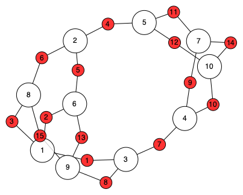
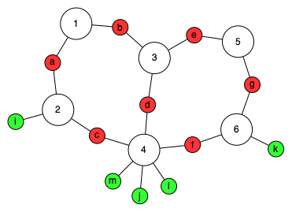
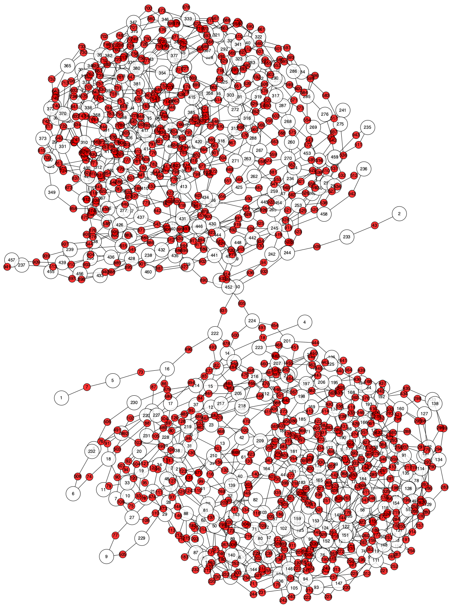

# LuxorTensorPlot.jl

[](https://ArrogantGao.github.io/LuxorTensorPlot.jl/stable/)
[](https://ArrogantGao.github.io/LuxorTensorPlot.jl/dev/)
[](https://github.com/ArrogantGao/LuxorTensorPlot.jl/actions/workflows/CI.yml?query=branch%3Amain)
[](https://codecov.io/gh/ArrogantGao/LuxorTensorPlot.jl)


`LuxorTensorPlot.jl` is a package based on `LuxorGraphPlot.jl` to plot tensor networks as hypergraphs, where the tensors are represented as nodes and the indices are represented as hyper-edges. The package is designed to be compatible with `OMEinsum.jl`.

In this package, the tensors are represented as big white nodes, and the indices are represented as small red nodes, and if the indices are open, they are represented as small green nodes.

## Installation

Press `]` to enter `pkg` mode in julia repl, and then type
```julia
] add LuxorTensorPlot
```
to install the packages needed.

## How to use

Here a few examples are provided to show how to use the package.

### Simple Graphs

Although this package is designed for tensor networks, it can also be used to plot simple graphs and hyper-graphs with the adjacency matrix. Here is an example to plot a simple graph, by transforming the simple graph as its adjacency matrix.

```julia
using LuxorTensorPlot, Graphs

graph = random_regular_graph(10, 3)
adj = adjacency_mat(graph)
graph_path = joinpath(@__DIR__ , "figs/simple_graph.png")
show_hypergraph(adj, filename = graph_path)
```

The result figure is shown below:




### Tensor Networks

Here is an example to plot a simple tensor network, with hand-crafted einsum code.
```julia
using OMEinsum, LuxorTensorPlot

simple_ecode = ein"(ab, ica), bde, cjfdlm, eg, gfk -> ijklm"
simple_path = joinpath(@__DIR__ , "figs/simple_hypergraph.png")
show_tensornetwork(simple_ecode, filename = simple_path)
```

The result figure is shown below:



It is also possible to use an eincode load from files
```julia
using OMEinsum, LuxorTensorPlot

complex_ecode = readjson(joinpath(@__DIR__ , "qc50.json")).eins
complex_path = joinpath(@__DIR__ , "figs/complex_hypergraph.png")
show_tensornetwork(complex_ecode, filename = complex_path)
```

